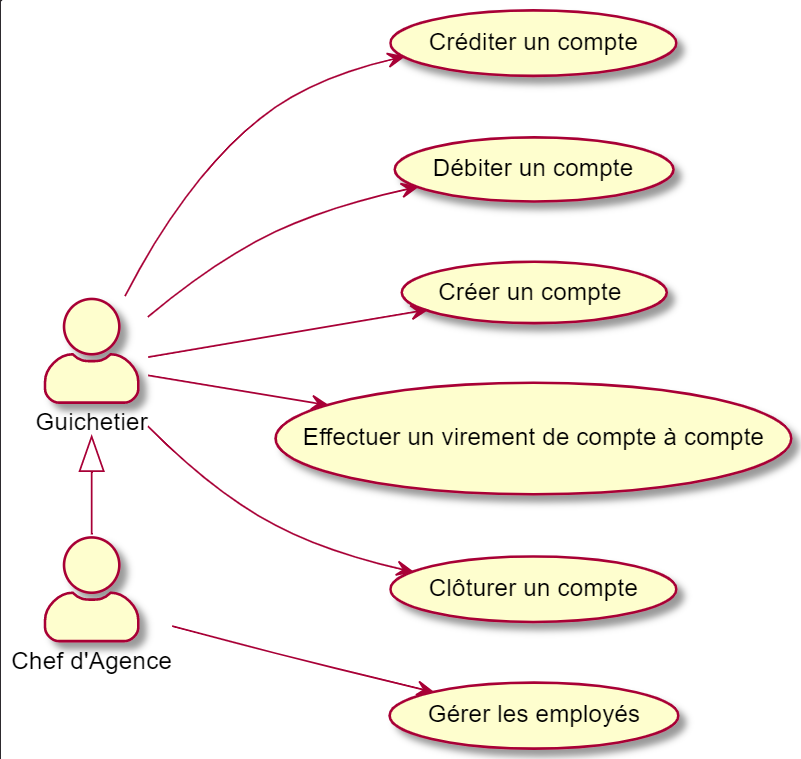
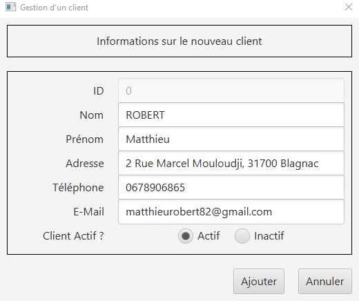

= Documentation Technique V1 Daily Bank App
XU Anton - GAYRARD Loan - ROBERT Matthieu
v1.0, 18/05/2022 - Equipe 1b1
:toc: preamble
:toc-title: Sommaire
:nofooter:

Equipe 1B1 - XU Anton - GAYRARD Loan - ROBERT Matthieu

<<<

== Présentation

Daily Bank App est une application de gestion des comptes clients pour la banque DailyBank. Cette application est à destination des employés de la banque, les guichetiers et les chef d'agences. 

=== Use Case global

Les guichetiers de la banque gèrent et consultent les profils des clients, créent et gèrent des comptes et également créditent, débitent et effectuent des virements de compte à compte. 

Le chef d'agence possède les mêmes fonctionnalités que le guichetier avec quelques possibilité en plus comme rendre inactif un client ou gérer les différents employés et guichetiers de l'agence.

=== Diagramme de classe de la base de donnée

image::../assets/doc_Tec_V1/Diagramme de classe de la base de donnée.png[dc Db]

Dans la base de donnée actuelle nous avons différentes tables qui sont reliées entre elles. 

Nous avons la table AgenceBancaire qui représente une agence bancaire avec un identifiant, un nom et une adresse postale, cette table est reliée par une clé étrangère à la table Employe, cette clé étrangère représente l'identifiant de l'employé qui est chef d'agence.

Nous avons la table Employe qui représente un employé avec un identifiant, un nom, un prenom, un chaine désignant ses droits d'accès, et ses identifiants de connexion. Cette table est reliée par une clé étrangère à la table AgenceBancaire, cette clé étrangère représente l'identifiant de l'agence bancaire à laquelle l'employé appartient.

Nous avons la table Client qui représente un client avec un identifiant, un nom, un prenom, une adresse postale, une adresse mail, un numéro de téléphone et également un attibut indiquant si le client est actif ou inactif. Cette table est reliée par une clé étrangère à la table AgenceBancaire, cette clé étrangère représente l'identifiant de l'agence bancaire à laquelle le client est associé.

Nous avons la table CompteCourant qui désigne un Compte bancaire avec un numéro de compte, un solde de débit autorisé et un solde de compte et qui est reliée par une clé étrangère à la table Client, cette clé étrangère représente l'identifiant du client auquel le compte courant est associé.

Nous avons la table Operation qui représente les différentes opérations effectuées sur un compte avec un identifiant d'opération, le montant de l'opération, la date de l'opération et qui est reliée par une clé étrangère à la table CompteCourant, cette clé étrangère représente l'identifiant du compte auquel l'opération est associée et également une clé étrangère vers la table TypeOperation qui permet d'identifier le type de l'opération.

<<<

== Architecture

=== Architecture générale

Voici l'architecture générale de l'application :

Dans cetta application nous avons une architecture où nous avons une base de donnée sur laquelle se connectent les différents utilisateurs de l'application, qui sont les guichetier et les chef d'agences. Les guichetiers et les chef d'agences ont accés en écriture et en lecture à la base de donnée afin de pouvoir ajouter de nouveaux et modifier des clients, ajouter, modifier et intéragir avec les comptes des clients. Le chef d'agence a également accés à la table contenant les employés de l'agence, afin de pouvoir en ajouter ou en supprimer ; il possède donc des privilèges plus élevés que les guichetiers.

=== Ressources externes utilisées

- Le fichier .jar de l'application, voir la documentation utilisateur pour plus de détails.

=== Structuration des packages

- application :

Nous retrouvons dans ce package principal la classe qui permet de lancer l'application (DailyBankApp.java) mais aussi la classe qui permet d'obtenir le statut de l'utilisateur connecté (chef d'agence ou employé).
Un fichier css est aussi présent afin de gérer le style de l'application.

- application.control :

Dans ce package sont présents les classes qui gèrent l'affichage des différentes fenêtres de l'application. Ces classes récupèrent notamment les fichiers fxml qui permettront par la suite de créer la structure des différentes fenêtres de l'application.

- application.tools :

Comme son nom l'indique, ce package contient diverses classes utiles, comme AlertUtilities.java qui va gérer l'affichage de fenêtres d'alerte, ou bien encore des classes qui vont permettre de gérer les crédits ou les débits (CategorieOperation.java).

- application.view :

Ce package contient les classes qui vont récupérer les différents éléments des fenêtres de l'application, comme les boutons, et va leur donner une action (ex : quand on clique sur un bouton, on va effectuer une certaine action). Ce package contient aussi les fichiers FXML qui seront ensuites récupérés par les classes du package application.control.

- model.data :

Ce package contient les classes principales, comme par exemple Client.java ou CompteCourant.java, qui vont être utilisés afin de créer des objets Client et CompteCourant nécessaires au bon fonctionnement de l'application et à la structuration du code.

- model.orm :

Ce package va contenir les classes qui communiquent avec la base de données. Comme classe importante nous pouvons citer AccesClient.java qui va chercher un client dans la base de donnée en fonction de son identifiant, de son age ou de son nom. Nous pouvons aussi noter LogToDatabase.java qui va permettre aux employés de l'agence de se connecter à la base de données afin de gérer les clients.

- model.orm.exception :

Dans ce package sont présents les différentes exceptions que l'application peut lever (erreur de connexion à la base de donnée, erreur de privilège...).

=== Eléments essentiels / spécificités

LogToDatabase.java
Client.java
CompteCourant.java
AccesClient.java

<<<

== Fonctionnalités
// Pour chaque fonctionnalité : en les expliquant
// Partie de use case réalisé - scénarios éventuels

// Partie du diagramme de classes données nécessaires : en lecture, en mise à jour

// Copies écrans principales de la fonctionnalité (ou renvoi vers doc utilisateur) + maquettes états imprimés (si concerné)

// Classes impliquées dans chaque package

// Eléments essentiels à connaître, spécificités, … nécessaires à la mise en œuvre du développement. Cette partie peut être illustrée par un diagramme de séquence

// Extraits de code significatifs commentés si nécessaires pour des points particuliers et importants
=== Partage du travail

.Loan
* xref:doc_Tec_V1.adoc#Consulter un compte[Consulter un compte]
* xref:doc_Tec_V1.adoc#Débiter un compte[Débiter un compte]

.Matthieu
* xref:doc_Tec_V1.adoc#Créer un client[Créer un client]
* xref:doc_Tec_V1.adoc#Modifier un client[Modifier un client]

.Anton
* xref:doc_Tec_V1.adoc#Rendre inactif un client[Rendre inactif un client]

=== V0

==== Créer un client

Création d'un nouveau client dans la base de donnée.

Pour créer un client il faut fournir :
    
    - Un nom
    - Un prénom
    - Une adresse postale
    - Un numéro de téléphone
    - Une adresse mail

Dans la base de donnée, on agit sur la table Client en écriture.

Voici une capture d'écran de l'interface de création d'un client :

Classes impliquées dans chaque package :
    
    application.control:
        - ClientsManagement
        - ClientEditorPane
    application.view:
        - ClientsManagementController
        - ClientEditorPaneController
    model.data:
        - Client
    application.tools:
        - ConstantesIHM
    
Voici un diagramme de séquence permettant d'observer le passage entre les différentes classes :

==== Modifier un client

Modification d'un client dans la base de donnée.

Les différentes modifications possibles pour un client sont :

    - Son nom
    - Son prénom
    - Son adresse postale
    - Son numéro de téléphone
    - Son adresse mail

Dans la base de donnée, on agit en lecture pour récupérer les information du client et en écriture pour ajouter les nouvelles informations du client, sur la table Client. 

Voici une capture d'écran de l'interface de modification d'un client :

Classes impliquées dans chaque package :
    
    application.control:
        - ClientsManagement
        - ClientEditorPane
    application.view:
        - ClientsManagementController
        - ClientEditorPaneController
    model.data:
        - Client
    application.tools:
        - ConstantesIHM
    
Voici un diagramme de séquence permettant d'observer le passage entre les différentes classes :

==== Rendre inactif un client

Rendre inactif un client est une spécificité de la modification d'un client.

L'état actif ou inactif d'un client peut seulement être modifié par un chef d'agence, nous le testons avec la méthode statique `ConstantesIHM.isAdmin(Employe)`.

.ClientEditorPaneController.java
[source,java]  
---- 
if (ConstantesIHM.isAdmin(this.dbs.getEmpAct())) {
    this.rbActif.setDisable(false);
    this.rbInactif.setDisable(false);
} else {
    this.rbActif.setDisable(true);
    this.rbInactif.setDisable(true);
----
Les boutons permettant la modification de l'activité sont activés conditionnellement.

clientEdite.estInactif est la variable String indiquant l'état d'activité du client. Sa valeur doit être changée grâce aux constantes `ConstantesIHM.CLIENT_ACTIF` ainsi que `ConstantesIHM.CLIENT_INACTIF`.

Classes impliquées dans chaque package :
    
    application.control:
        - ClientsManagement
        - ClientEditorPane
    application.view:
        - ClientsManagementController
        - ClientEditorPaneController
    model.data:
        - Client
    application.tools:
        - ConstantesIHM

Le diagramme de séquence est identique à celui de Modifier un client car l'activité d'un client est un des attributs modifiables d'un client.

==== Consulter un compte

Consulter un compte est une fonctionnalité importante pour une banque, afin de gérer les comptes de ses clients et de veiller au bon fonctionnement d’une banque.
Pour consulter un compte d’un client de la banque, il nous faut :

- Le client en question
- Le compte du client

Voici le diagramme de séquence qui illustre le chemin parcouru depuis le lancement de l'application afin de consulter le compte d’un client :

Les Classes impliquées dans chaque package pour le bon fonctionnement de cette action sont :

    application.control
        - DailyBankMainFrame.java
        - ClientsManagement.java
        - ComptesManagement.java
        - OperationsManagement.java
        - OperationEditorPane.java

    application.tools
        - AlertUtilities.java
        - CategorieOperation.java
        - EditionMode.java
        - PairsOfValue.java
        - StageManagement.java

    application.view :
        - DailyBankMainFrameController.java
        - ClientsManagementController.java
        - ComptesManagementController.java
        - OperationsManagementController.java
        - OperationEditorPaneController.java

==== Débiter un compte

Enregistrer un débit est une fonctionnalité essentielle à toute banque, par exemple lors d'un achat en ligne, il est essentiel de débiter le client de la somme qu’il a dépensé.
Pour débiter un client il nous faut :

- Le client en question
- Son compte à débiter
- La somme à débiter

Voici la fonctionnalité enregistrer un débit en détail avec le diagramme de séquence depuis l'écran d'accueil de l'application :

Les Classes impliquées dans les packages application pour le bon fonctionnement de cette action sont :

    application.control :
        - DailyBankMainFrame.java
        - ClientsManagement.java
        - ComptesManagement.java
        - OperationsManagement.java
        - OperationEditorPane.java

    application.tools :
        - AlertUtilities.java
        - CategorieOperation.java
        - EditionMode.java
        - PairsOfValue.java
        - StageManagement.java

    application.view :
        - DailyBankMainFrameController.java
        - ClientsManagementController.java
        - ComptesManagementController.java
        - OperationsManagementController.java
        - OperationEditorPaneController.java

=== V1

==== Créditer un compte

Créditer un compte est une fonctionnalité essentielle à toute banque, par exemple lors d'un dépot de chèque où bien lors du jour de paye, il est essentiel de créditer le client de la somme qu’il a reçu.

Pour créditer un client nous avons besoins des informations suivantes :

    - Le client en question
    - Son compte à créditer
    - La somme à créditer

Voici le diagramme de séquence depuis l'écran d'accueil de l'application afin de créditer un client :

image::../assets/doc_Tec_V1/credit.PNG[Diagramme de séquence créditer un client]

Les classes impliquées dans les packages application pour créditer un compte sont :

    application.control :
        - DailyBankMainFrame.java
        - ClientsManagement.java
        - ComptesManagement.java
        - OperationsManagement.java
        - OperationEditorPane.java

    application.tools :
        - AlertUtilities.java
        - CategorieOperation.java
        - EditionMode.java
        - PairsOfValue.java
        - StageManagement.java

    application.view :
        - DailyBankMainFrameController.java
        - ClientsManagementController.java
        - ComptesManagementController.java
        - OperationsManagementController.java
        - OperationEditorPaneController.java

==== Clôturer un compte

==== Effectuer un virement de compte à compte

==== Créer un employé

==== Modifier un employé

==== Supprimer un employé
