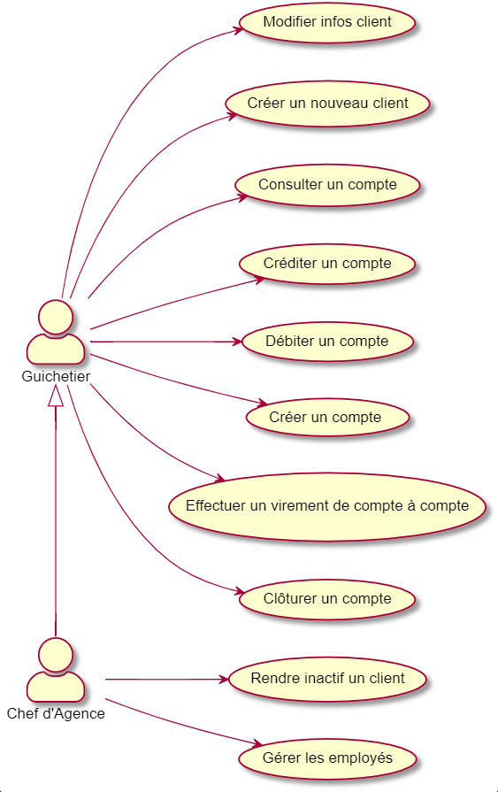

= CDCU V2 Daily Bank App
XU Anton - GAYRARD Loan - ROBERT Matthieu
v2.0, 20/04/2022 - Equipe 1b1
:toc:
:toc-title: Sommaire
:nofooter:

<<<

== Présentation du sujet

Dans le contexte actuel des banques françaises avec l’arrivée des néobanques, il est important pour les banques historiques de se digitaliser et d’utiliser de plus en plus d’outils informatiques. Ceux-ci permettront d’effectuer en temps réel et de rendre accessibles les différentes opérations bancaires, autant pour les employés d’agence bancaire que pour les clients. En effet, la robotisation et le développement digital des services bancaires permettront de satisfaire les exigences d’instantanéité et d’efficacité des clients. C’est ainsi que notre projet Daily Bank App s’inscrit dans la modernisation de la banque Daily Bank. Daily Bank App est une application JAVA-Oracle de gestion des comptes clients pour une banque nommée Daily Bank. Cette célèbre banque possède déjà une application, mais elle est incomplète et il lui manque de nombreuses fonctionnalités. Elle souhaite proposer à ses clients une application rapide et simple d’utilisation, qui leur permettra d’interagir avec leur compte bancaire de manière instantanée. Cette application devra donc simplifier les actions bancaires des utilisateurs, mais elle devra aussi aider les employés de l’entreprise en leur permettant de gérer les comptes des clients en ligne et de manière immédiate. Pour ce projet, nous sommes une équipe de 3 développeurs, et grâce à nos compétences en informatique nous allons nous organiser pour proposer et implémenter de meilleures versions de l’application Daily Bank App qui, au fur et à mesure des versions, vont simplifier les relations entre les clients et les employés.

<<<

== Analyse de l'existant

Diagramme de cas d'utilisation de la V0 et la V1

Dans la V1, nous avons deux profils d'utilisateurs qui sont le Guichetier et le Chef d'agence. Le Guichetier peut créer et gérer les clients, il peut également créer des comptes, les créditer, le débiter, faire des virements de comptes à comptes et également les clôturer. Le chef d'agence est un Guichetier qui, en plus, peut rendre inactif un client et gérer les différents employés de l'agence.

Ces différents cas d'utilisation, sont suffisants pour une version minimale de l'application, même s'il manque encore quelques fonctionnalités. 

<<<

== Analyse des besoins de la V2

Diagramme de cas d'utilisation de la V2

image::../assets/ucv2.png[uc V2, 500]

Le guichetier doit avoir la possibilité de générer un relevé mensuel d'un compte en PDF sur lequel figurera les différentes opérations effectuées sur le compte pendant un mois donné.

Le guichetier doit avoir la possibilité de gérer les prélèvements automatiques.

Le chef d'agence doit avoir la possibilité d'effectuer un débit exceptionnel.

Le chef d'agence doit avoir la possibilité de simuler un emprunt à l'aide des informations d'un client.

Le chef d'agence doit avoir la possibilité de simuler une assurance d'emprunt à l'aide des différentes informations d'un client.

<<<

== Analyse des contraintes

=== Contraintes techniques

Les nouvelles versions devront être programmées en Java, en couple avec le système de gestion de base de données Oracle. Ce dernier devra stocker toutes les procédures effectuées sur les comptes.

=== Contraintes organisationnelles

La V2 devra être produite durant les semaines 22 à 23, et devra être livrée le 3 juin 2022, avec la participation de tous les membres du groupe.

L'organisation du développement de l'application se fera par Git, chaque fonctionnalité développée aura sa propre branche.

Finalement, nous effectuerons un merge de toutes les branches par l'intermédiaire de pull requests.

Lors de ce projet, Project Libre sera utilisé pour la réalisation du Gantt, Asciidoc sera utilisé pour la rédaction du cahier des charges, de la documentation utilisateur et de la documentation technique.

Le suivi de l'avancée du projet se fera à l'aide des issues sur GitHub.

=== Contraintes juridiques

Tout d'abord, notre application devra respecter les contraintes juridiques de protection de données des utilisateurs.

Les données sensibles des clients de la banque, comme les numéros de carte bancaire ou bien les données personnelles, devront être stockés de manière sécurisée afin d'éviter toute fuite de données.

De plus, notre application devra être éthique et modifier les données des clients seulement si ces derniers le souhaitent (numéro de carte bleue, propriétaire du compte...) et modifier le solde des comptes bancaires seulement lorsqu'un achat est effectué.

Notre application devra donc rester sécurisée et fiable afin de respecter les lois en vigueur, mais aussi de rassurer les futurs clients de la banque et utilisateurs de l'application.