= Documentation utilisateur V2 Daily Bank App
XU Anton - GAYRARD Loan - ROBERT Matthieu
v2.0, 16/05/2022 - Equipe 1b1
:toc:
:toc-title: Sommaire
:nofooter:

== Présentation de l'application

Daily Bank App est une application de gestion des comptes clients pour la banque DailyBank. Cette application est à destination des employés de la banque, les guichetiers et les chef d'agences. 

Elle permet aux guichetiers de la banque de gérer et consulter les profils des clients, de créer et gérer des comptes et également de créditer, débiter et effectuer des virements de compte à compte. 

Le chef d'agence possède les mêmes fonctionnalités que le guichetier avec quelques possibilité en plus comme rendre inactif un client ou des gérer les différents employés et guichetiers de l'agence.

== Installation et lancement de l'application

Prérequis: Avoir Java 8 installé

Etapes:

    - Télécharger le fichier DailyBankV0.jar
    - Ouvrir le fichier DailyBankV0.jar en double cliquant dessus

== Explications des différents rôles

Dans cette application, il existe différents rôles qui peuvent effectuer différentes actions. Il y a le guichetier qui peut effectuer différentes actions de création et de modification sur les clients et les comptes. Il y a le chef d'agence qui peut effectuer les mêmes actions que le guichetier mais il peut aussi gérer (créer, modifier et supprimer) les guichetiers de l'agence.

== Utilisation de l'application

=== Créer un client

Pour créer un client, le guichetier ou le chef d'agence doit doit ouvrir le menu de gestion des clients, en allant dans le menu gestion et cliquer sur le bouton client.

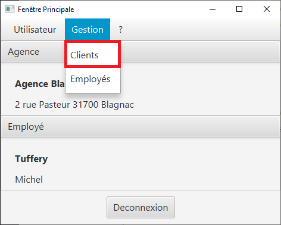

Un fois sur la fenêtre de gestion des clients, l'utilisateur doit cliquer sur le bouton "Nouveau client"

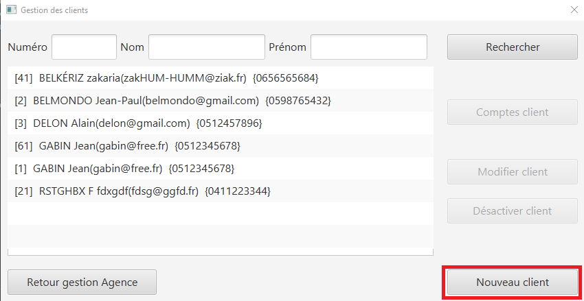

Dès que l'utilisateur à cliqué sur le bouton "Nouveau client", un nouvelle fenêtre s'ouvre afin de pouvoir rentrer les informations du client (nom, prénom, adresse, numéro de téléphone et adresse mail) et cliquer sur le bouton ajouter, pour créer le client. Sur cette fenêtre, il y a également la possibilité pour le chef d'agence de décider si le client est actif ou inactif.

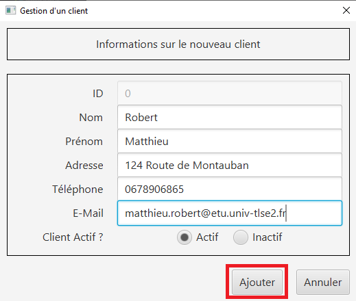

=== Modifier un client

Pour créer un client, le guichetier ou le chef d'agence doit doit ouvrir le menu de gestion des clients, en allant dans le menu gestion et cliquer sur le bouton client.

Un fois sur la fenêtre de gestion des clients, l'utilisateur doit sélectionner un client et cliquer sur le bouton "Modifier client"

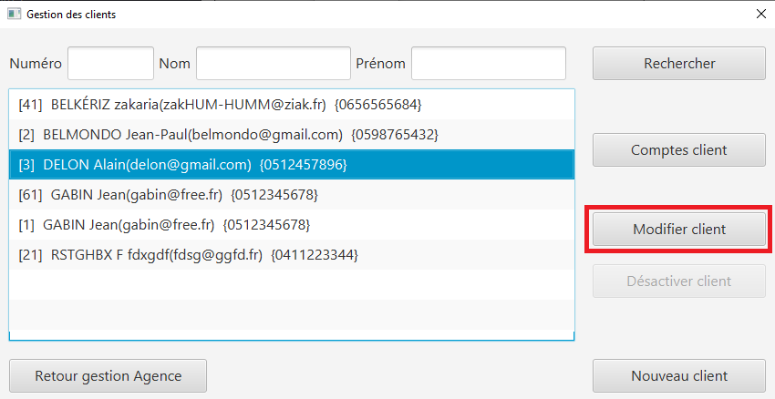

Dès que l'utilisateur à cliqué sur le bouton "Modifier client", un nouvelle fenêtre s'ouvre afin de pouvoir rentrer les informations à changer du client (nom, prénom, adresse, numéro de téléphone et adresse mail) et cliquer sur le bouton "modifier", pour modifier le client. Sur cette fenêtre, il y a également la possibilité pour le chef d'agence de décider si le client est actif ou inactif.

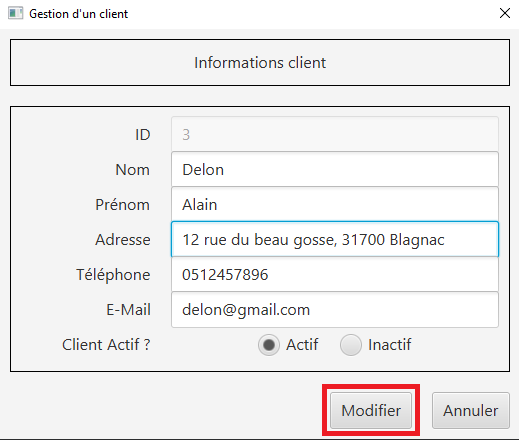

=== Créer un compte (Matthieu)

Pour créer un compte, le guichetier ou le chef d'agence doit sélectionner un client et ouvrir le menu de gestion des comptes, en cliquant sur le bouton "Comptes client" sur le menu de gestion des clients :

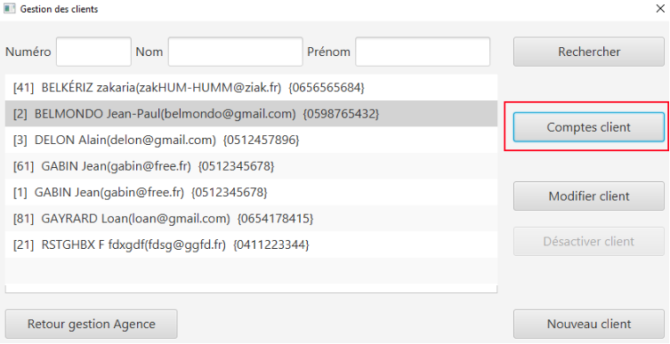

Une fois sur la fenêtre de gestion des comptes, l'utilisateur doit cliquer sur le bouton "Nouveau compte"

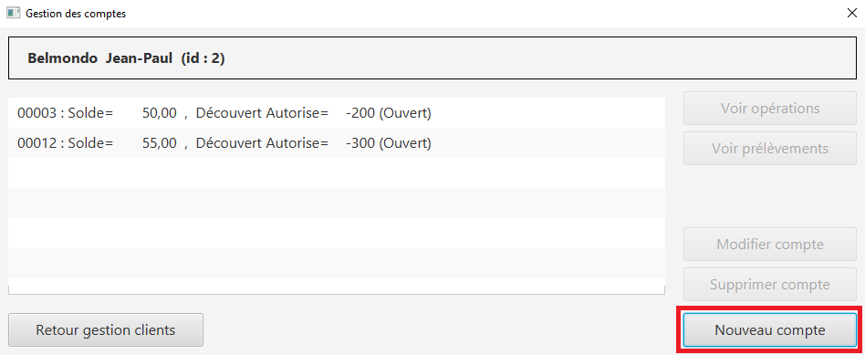

Dès que l'utilisateur à cliqué sur le bouton "Nouveau compte", un nouvelle fenêtre s'ouvre afin de pouvoir rentrer les informations du compte (découvert autorisé et montant de dépôt initial qui doit être supérieur à 50€) et cliquer sur le bouton ajouter, pour créer le compte. 

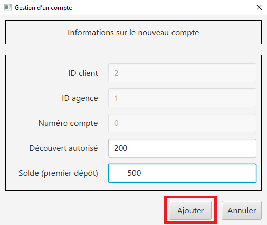

Et voilà ! Le compte est créé ! Il apparaît maintenant dans la liste des comptes du client.

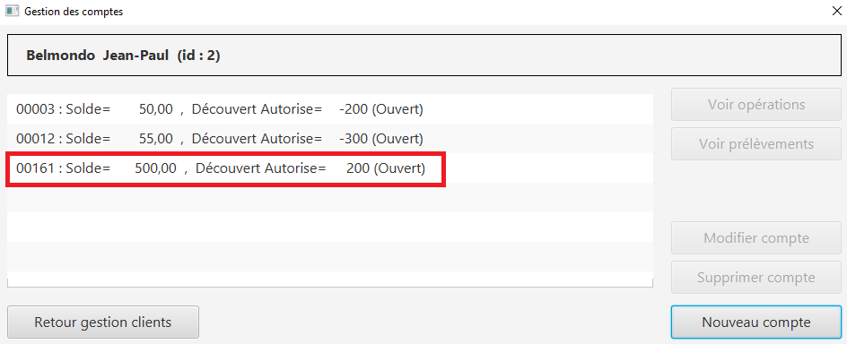

=== Débiter un compte

Pour débiter un compte, le guichetier ou le chef d'agence doit ouvrir le menu de gestion des comptes, en allant dans le menu gestion et cliquer sur le bouton Comptes client.

Une nouvelle fenêtre s'ouvre, afin de pouvoir sélectionner le compte du client à débiter. Une fois le bon compte bancaire sélectionné, il faut cliquer sur le bouton "Voir opérations" :

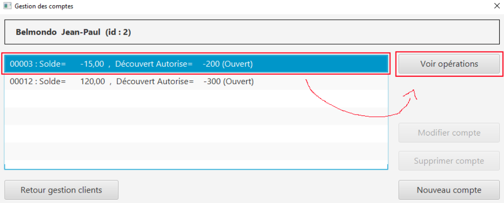

Il suffit ensuite de cliquer sur le bouton "Enregistrer débit" et d'entrer les informations sur ce débit (montant, type) avant de valider l'opération :

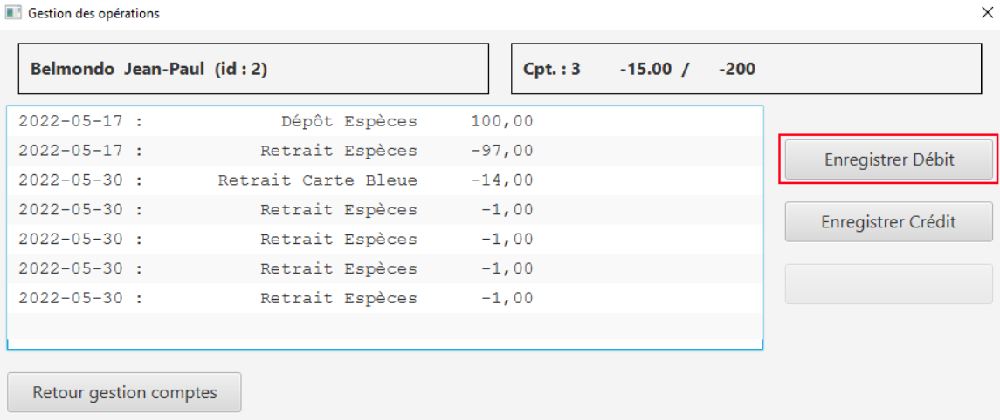

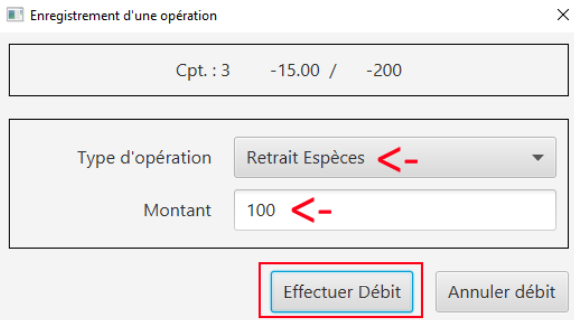

Et voila ! Le débit est effectué ! Il apparaît maintenant dans la liste des opérations du compte :

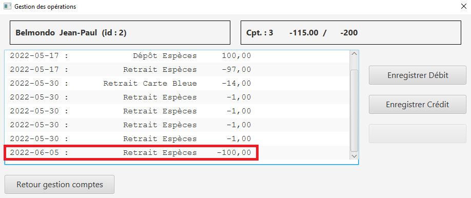

=== Créditer un compte

De la même façon que débiter un compte, le guichetier ou le chef d'agence peut créditer un compte. Pour cela, il suffit de se rendre sur la page de gestion des opérations d'un compte xref:doc_User_V2.adoc#débiter-un-compte[voir débiter un compte] et de cliquer sur le bouton "Enregistrer Crédit" :

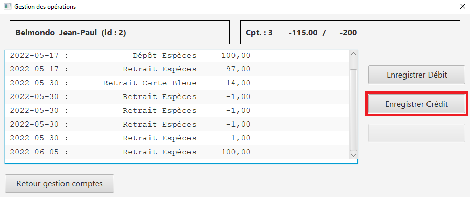

Une fois sur la page d'enregistrement d'un crédit, il faut tout comme le débit indiquer le montant du crédit et le mode avant de cliquer sur le bouton "Effectuer un crédit" :

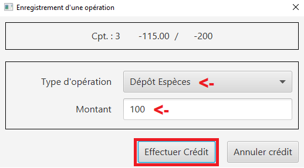

Et voila ! Le crédit est effectué ! Il apparaît maintenant dans la liste des opérations du compte :

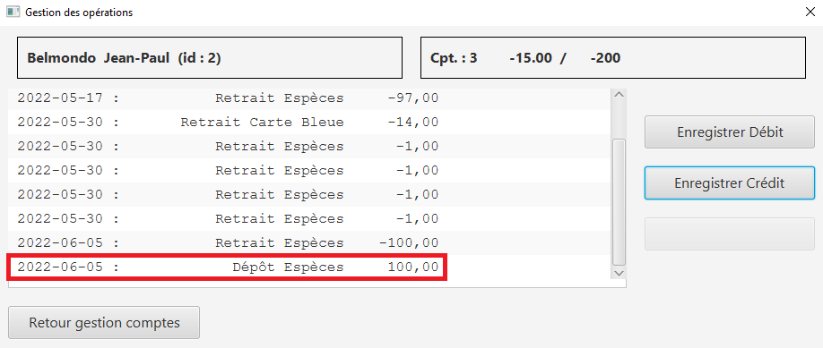

=== Clôturer un compte

Pour clôturer un compte, il faut que le solde du compte soit égal à 0.

Pour clôturer un compte, le guichetier ou le chef d'agence doit ouvrir le menu de gestion des comptes, puis sélectionner un client et cliquer sur le bouton "Clôturer compte" : 

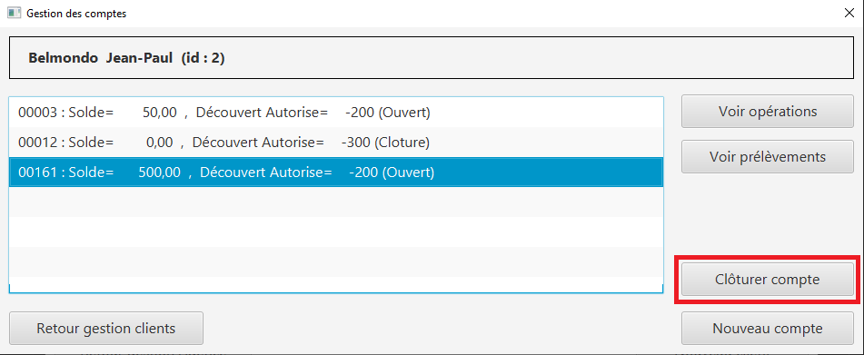

Lorsque l'utilisateur clique sur le bouton clôturer compte, si le solde du compte n'est pas égal à 0, une fenêtre d'erreur s'ouvre indiquant que le compte ne peut pas être clôturé :

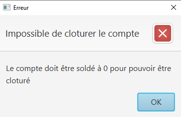

Lorsque l'utilisateur clique sur le bouton clôturer compte, si le solde du compte est égal à 0, une fenêtre de confirmation s'ouvre pour confirmer la clôture du compte :

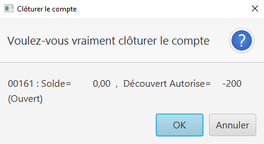

=== Rendre inactif un client (Anton)

Afin de rendre inactif un client, se rendre sur la fenêtre de gestion des clients afin de xref:doc_User_V1.adoc#modifier-un-client[modifier le client] :

Ensuite, il suffit de cocher le bouton "Inactif" puis de valider la modification en cliquant sur "Modifier" comme indiqué dans l'image ci-dessous :

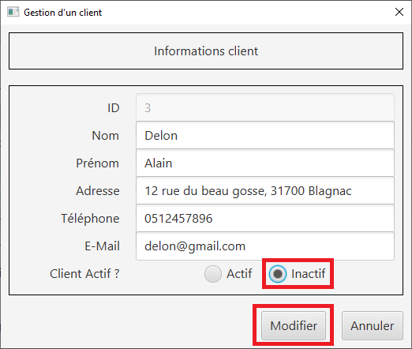

=== Gérer les employés (Anton)

Pour pouvoir accéder à la gestion d'un employé, il faut d'abord être connecté en tant que chef d'agence.

Pour accéder au menu de gestion des employés, depuis le menu principal, cliquer sur Gestion puis Employé :

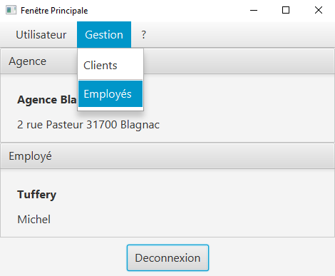

Ensuite, il suffit de cliquer sur les différents boutons afin d'effectuer les actions voulues pour la gestion des comptes des employés :

- Rechercher
- Créer
- Modifier
- Supprimer

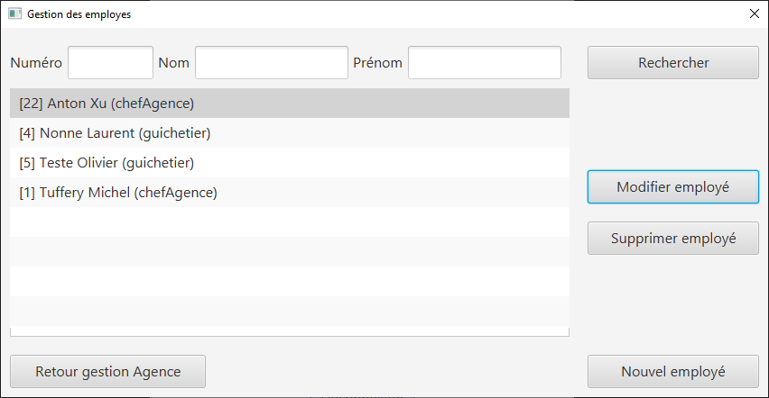

Le numéro entre crochets est le numéro de l'employé.

=== Effectuer un virement de compte à compte (Matthieu)

Comme pour le débit ou le crédit d'un compte, le virement peut être éffectué par le guichetier ou le chef d'agence. Le virement de compte à compte est possible uniquement entre deux comptes d'un même client.

Pour effectuer un virement, il suffit de se rendre sur la page de gestion  des opération d'un compte et de cliquer sur le bouton "Effectuer virement" :

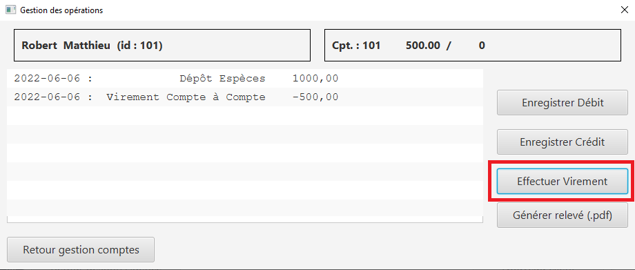

Une fois sur la page d'enregistrement d'un virement, il faut sélectionner le compte qui va recevoir le virement et indiquer le montant du virement avant de cliquer sur le bouton "Effectuer un virement" :

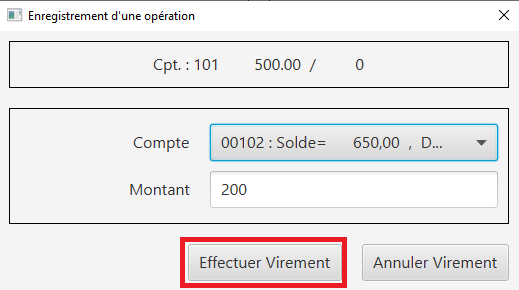

Et voilà ! Le virement est effectué ! Il apparaît maintenant dans la liste des opérations des deux compte concerné par le virement :

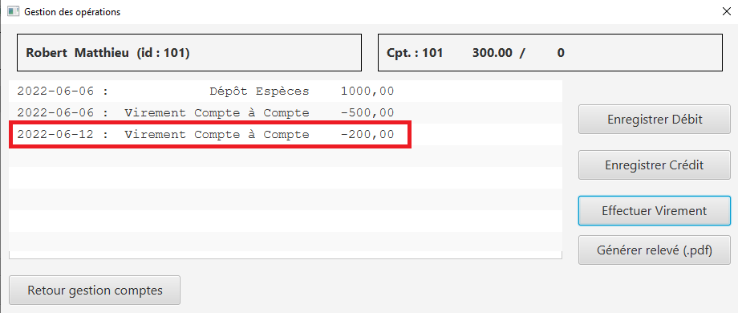

=== Générer un relevé de compte en pdf

Pour pouvoir générer le relevé d'un compte en pdf, il faut tout d'abord se rendre sur la page de gestion des opérations d'un compte xref:doc_User_V2.adoc#débiter-un-compte[voir débiter un compte] et cliquer sur le bouton "Générer relevé (.pdf)"

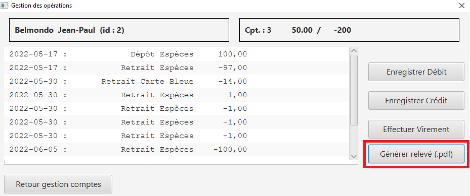

Une nouvelle fenêtre s'ouvre afin de sélectionner le dossier où le fichier sera enregistré et de donner un nom au fichier. Une fois ces deux informations saisies, il ne reste plus qu'à cliquer sur le bouton "Générer le pdf" et le relevé de compte sera disponible ! Remarque : il n'est pas nécessaire de rajouter le .pdf à la fin du nom du fichier, il sera ajouté automatiquement par le programme !

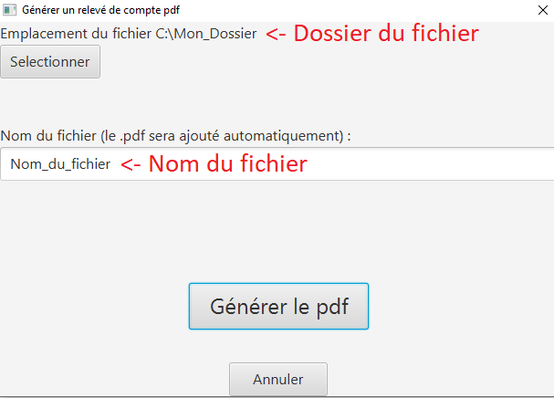

=== Gérer les prélèvements automatiques

Pour accéder à la gestion des prélèvements automatiques, il faut d'abord se rendre sur la page des gestion des comptes, puis sélectionnner un compte et cliquer sur le bouton "Voir prélèvments"

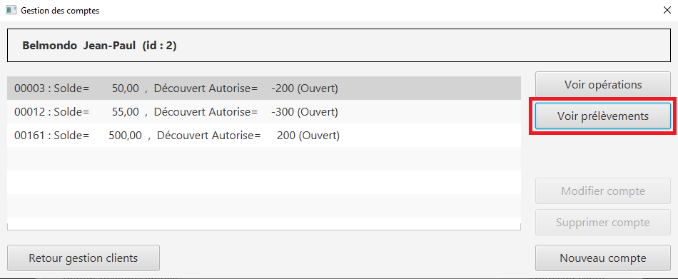

Une fois sur la page de gestion des prélèvements, vous pouvez ajouter, modifier ou supprimer un prélèvement.

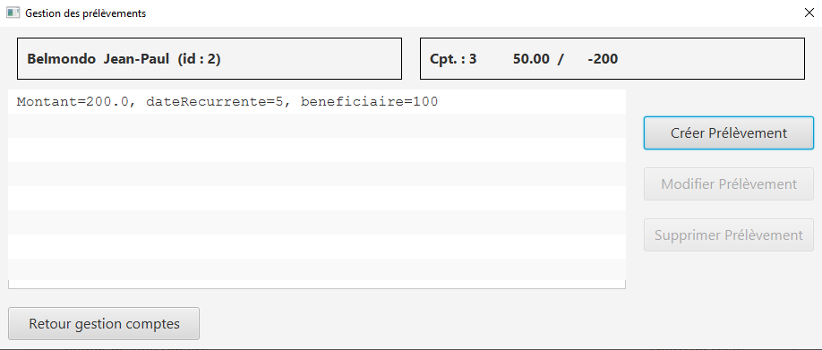

Pour créer un prélèvement, il suffit de cliquer sur le bouton "Créer un prélèvement" et la fenêtre d'édition d'un prélèvement apparaît.

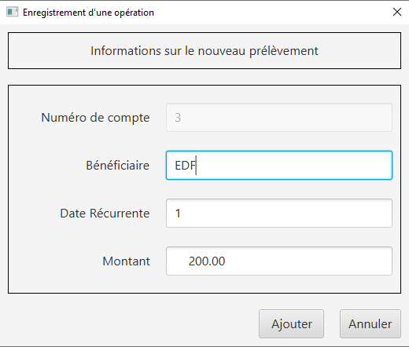

Pour modifier un prélèvement, il suffit de sélectionner un prélèvement et de cliquer sur le bouton "Modifier Prélèvement" et la fenêtre d'édition d'un prélèvement apparaît.

Pour supprimer un prélèvement, il suffit de sélectionner un prélèvement et de cliquer sur le bouton "Supprimer Prélèvement" et la fenêtre de confirmation apparaît.

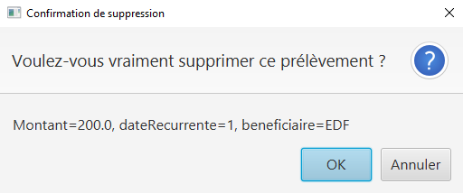