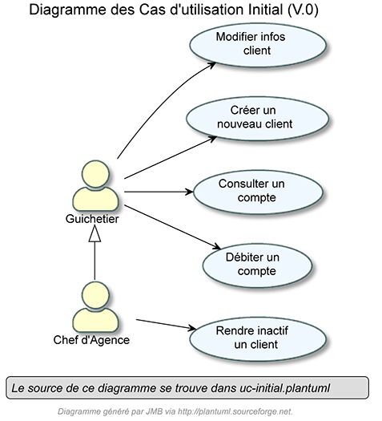

= CDCU V1
XU Anton - GAYRARD Loan - ROBERT Matthieu
:toc:
:toc-title: Sommaire
:nofooter:

<<<

== Présentation du sujet

Notre projet s’intitule Daily Bank App, il s’agit d’une application JAVA-Oracle de gestion des comptes clients pour une banque nommée Daily Bank. Cette célèbre banque possède déjà une application, mais elle est incomplète et il lui manque de nombreuses fonctionnalités. Elle souhaite proposer à ses clients une application rapide et simple d’utilisation, qui leur permettra d’interagir avec leur compte bancaire de manière instantanée. Cette application devra donc simplifier les actions bancaires des utilisateurs, mais elle devra aussi aider les employés de l’entreprise en leur permettant de gérer les comptes des clients en ligne et de manière immédiate. Pour ce projet, nous sommes une équipe de 3 développeurs, et grâce à nos compétences en informatique nous allons nous organiser pour proposer et implémenter de meilleures versions de l’application Daily Bank App qui, au fur et à mesure des versions, vont simplifier les relations entre les clients et les employés.

<<<

== Analyse de l'existant

Dans la V0, les opérations possibles sont encore très limitées, il n'est pas possible de créer de nouveau compte ni de créditer un compte.

Les seuls 5 cas d'utilisation ne permettent pas encore à l'application existante d'être utilisée telle quelle.

<<<

== Analyse des besoins de la V1

Digramme de cas d'utilisation de la V1

image::assets/ucv1.png[uc V1, 500]

Le guichetier doit avoir la possibilité de créditer un compte d'un client avec un montant donné, afin d'ajouter de l'argent sur son compte.

Le guichetier doit avoir la possibilité de débiter un compte d'un client avec un montant donné, afin de retirer de l'argent sur son compte.

Le guichetier doit avoir la possibilité de créer un compte pour un client, et de l'ajouter à la base de donnée des comptes.

Le guichetier doit avoir la possibilité d'effectuer des virements de compte à compte, avec un montant donné.

Le guichetier doit avoir la possibilité de clôturer un compte d'un client, afin de le rendre inactif.

Le chef d'agence doit avoir la possibilité d'effectuer les mêmes opérations que le guichetier, mais avec plus de contrôle.

Le chef d'agence doit avoir la possibilité de gérer les employés de son agence.

<<<

== Analyse des contraintes

=== Contraintes techniques

Les nouvelles versions devront être programmées en Java, en couple avec le système de gestion de base de données Oracle. Ce dernier devra stocker toutes les procédures effectuées sur les comptes.

=== Contraintes organisationnelles

La V1 devra être produite durant les semaines 19 à 22, avec la participation de tous les membres du groupe.
L'organisation du développement de l'application se fera par Git, chaque fonctionnalité développée aura sa propre branche.

Finalement, nous effectuerons un merge de toutes les branches par l'intermédiaire de pull requests.
