= Documentation utilisateur V1 Daily Bank App
XU Anton - GAYRARD Loan - ROBERT Matthieu
v1.0, 16/05/2022 - Equipe 1b1
:toc:
:toc-title: Sommaire
:nofooter:

== Présentation de l'application

Daily Bank App est une application de gestion des comptes clients pour la banque DailyBank. Cette application est à destination des employés de la banque, les guichetiers et les chef d'agences. 

Elle permet aux guichetiers de la banque de gérer et consulter les profils des clients, de créer et gérer des comptes et également de créditer, débiter et éffectuer des virements de compte à comptes. 

Le chef d'agence possède les même fonctionnalité que le guichetier avec quelques possibilité en plus comme rendre inactif un client ou des gérer les différents employés et guichetiers de l'agence.

== Installation et lancement de l'application

Prérequis: Avoir Java 8 installé

Etapes:

    - Télécharger le fichier DailyBankV0.jar
    - Ouvrir le ficheir DailyBankV0.jar en double cliquant dessus

== Utilisation de l'application

=== Explications des différents rôles

Dans cette application, il existe différents rôles qui peuvent effectuer différentes actions. Il y a le guichetiers qui peut éffectuer différentes action de création et de modification sur les clients et les comptes. Il y a le chef d'agence qui peut éffectuer les mêmes actions que le guichetier mais il peut aussi gérer (créer, modifier et supprimer) les guichetiers de l'agence.

=== Fonctionnalités de l'application

==== Créer un client

Pour créer un client, le guichetier ou le chef d'agence doit doit ouvrir le menu de gestion des clients, en allant dans le menu gestion et cliquer sur le boutton client.

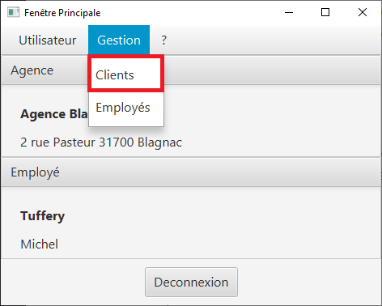

Un fois sur la fenêtre de gestion des clients, l'utilisateur doit cliquer sur le bouton "Nouveau client"

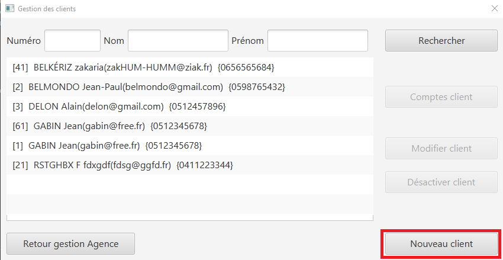

Dès que l'utilisateur à cliqué sur le bouton "Nouveau client", un nouvelle fenêtre s'ouvre afin de pouvoir rentrer les informations du client (nom, prénom, adresse, numéro de téléphone et adresse mail) et cliquer sur le bouton ajouter, pour créer le client. Sur cette fenetre, il y a également la possibilité pour le chef d'agence de décider si le client est actif ou inactif.

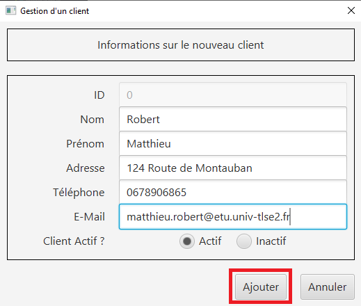

==== Modifier un client

Pour créer un client, le guichetier ou le chef d'agence doit doit ouvrir le menu de gestion des clients, en allant dans le menu gestion et cliquer sur le boutton client.

Un fois sur la fenêtre de gestion des clients, l'utilisateur doit sélectionner un client et cliquer sur le bouton "Modifier client"

image::../assets/docUserV1/menu_modif_client.png[menu modification client]

Dès que l'utilisateur à cliqué sur le bouton "Modifier client", un nouvelle fenêtre s'ouvre afin de pouvoir rentrer les informations à changer du client (nom, prénom, adresse, numéro de téléphone et adresse mail) et cliquer sur le bouton "modifer", pour modifier le client. Sur cette fenetre, il y a également la possibilité pour le chef d'agence de décider si le client est actif ou inactif.

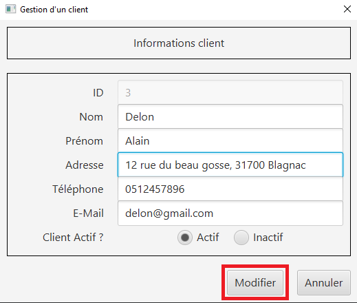

==== Consulter un compte

==== Débiter un compte

Pour débiter un compte, le guichetier ou le chef d'agence doit ouvrir le menu de gestion des comptes, en allant dans le menu gestion et cliquer sur le bouton Comptes client.

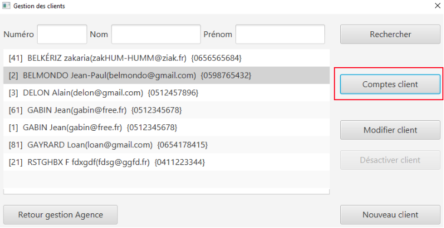

Une nouvelle fenêtre s'ouvre, afin de pouvoir sélectionner le compte du client à débiter. Une fois le bon compte bancaire sélectionné, il faut cliquer sur le bouton "Voir opérations" :

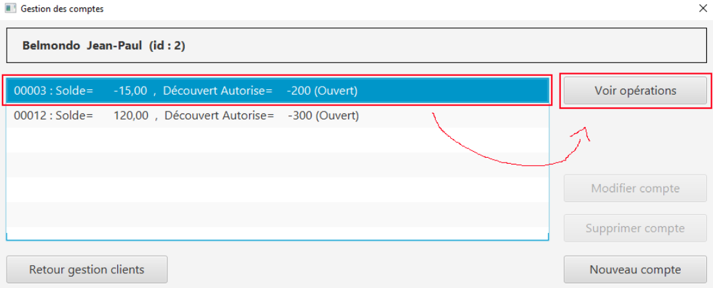

Il suffit ensuite de cliquer sur le bouton "Enregistrer débit" et d'entrer les informations sur ce débit (montant, type) avant de valider l'opération :

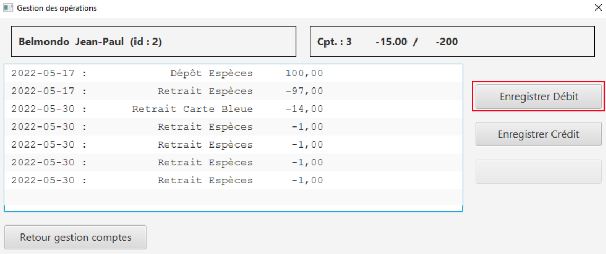

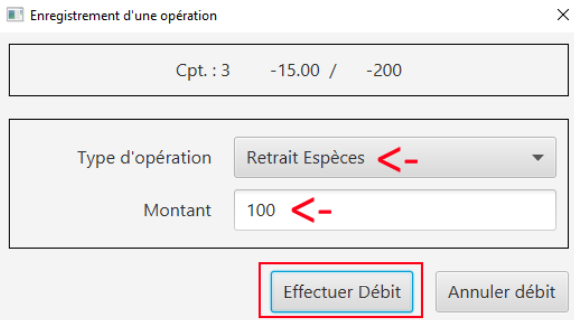

Et voila ! Le débit est effectué ! Il apparait maintenant dans la liste des opérations du compte :

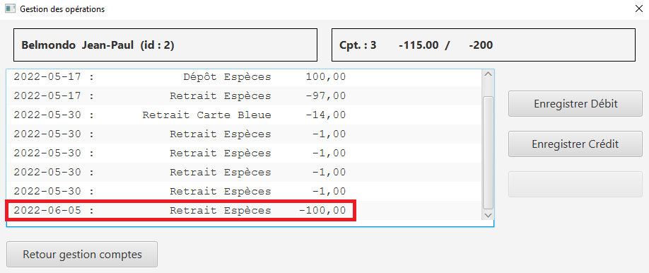

==== Créditer un compte

De la même façon que débiter un compte, le guichetier ou le chef d'agence peut créditer un compte. Pour cela, il suffit de se rendre sur la page de gestion des opérations d'un compte xref:docUserV1.adoc#débiter-un-compte[voir débiter un compte] et de cliquer sur le bouton "Enregistrer Crédit" :

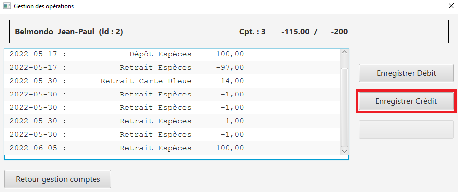

Une fois sur la page d'enregistrement d'un crédit, il faut tout comme le débit indiquer le montant du crédit et le mode avant de cliquer sur le bouton "Effectuer un crédit" :

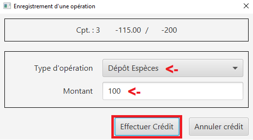

Et voila ! Le crédit est effectué ! Il apparait maintenant dans la liste des opérations du compte :

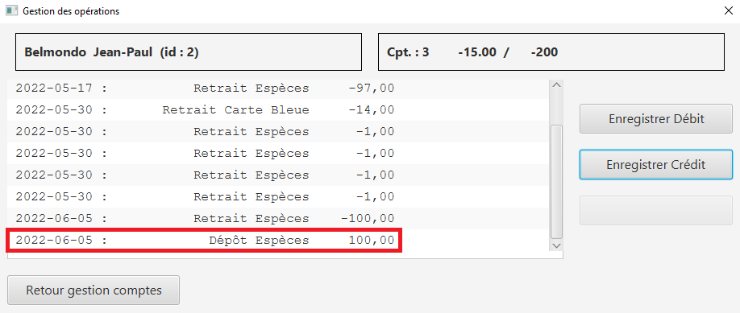

==== Rendre inactif un client

