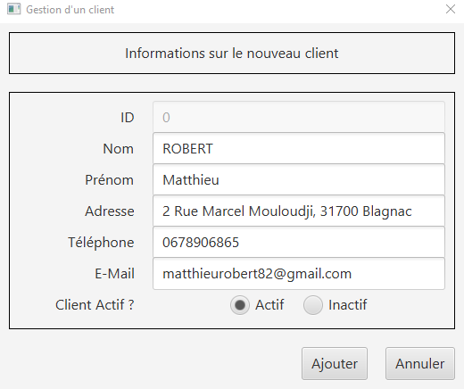
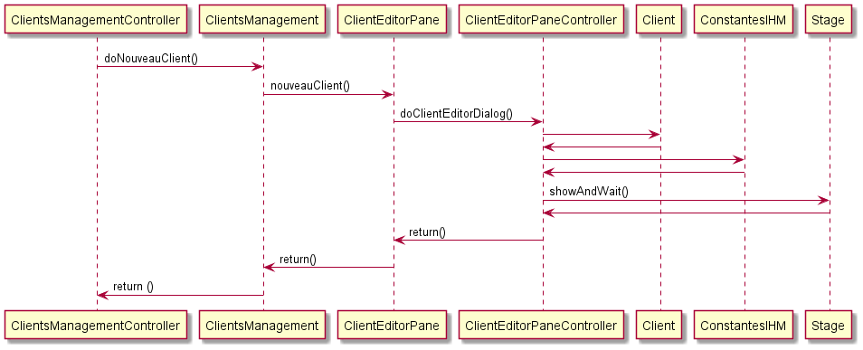
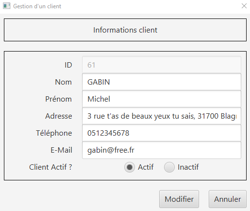
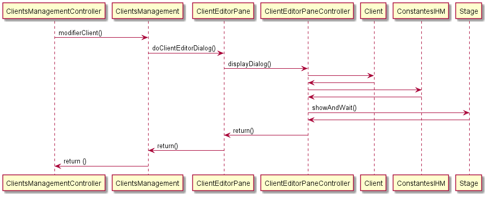

= Documentation Technique V1 Daily Bank App
XU Anton - GAYRARD Loan - ROBERT Matthieu
v1.0, 18/05/2022 - Equipe 1b1
:toc: preamble
:toc-title: Sommaire
:nofooter:

Equipe 1B1 - XU Anton - GAYRARD Loan - ROBERT Matthieu

<<<

== Présentation

Daily Bank App est une application de gestion des comptes clients pour la banque DailyBank. Cette application est à destination des employés de la banque, les guichetiers et les chef d'agences. 

=== Use Case global

image::../assets/ucv1.png[uc V1, 500]

Les guichetiers de la banque gèrent et consultent les profils des clients, créent et gèrent des comptes et également créditent, débitent et effectuent des virements de compte à compte. 

Le chef d'agence possède les mêmes fonctionnalités que le guichetier avec quelques possibilité en plus comme rendre inactif un client ou gérer les différents employés et guichetiers de l'agence.

=== Diagramme de classe de la base de donnée

image::../assets/v1/dcDb.v1/Diagramme de classe de la base de donnée.png[dc Db]

Dans la base de donnée actuelle nous avons différentes tables qui sont reliées entre elles. 

Nous avons la table AgenceBancaire qui représente une agence bancaire avec un identifiant, un nom et une adresse postale, cette table est reliée par une clé étrangère à la table Employe, cette clé étrangère représente l'identifiant de l'employé qui est chef d'agence.

Nous avons la table Employe qui représente un employé avec un identifiant, un nom, un prenom, un chaine désignant ses droits d'accès, et ses identifiants de connexion. Cette table est reliée par une clé étrangère à la table AgenceBancaire, cette clé étrangère représente l'identifiant de l'agence bancaire à laquelle l'employé appartient.

Nous avons la table Client qui représente un client avec un identifiant, un nom, un prenom, une adresse postale, une adresse mail, un numéro de téléphone et également un attibut indiquant si le client est actif ou inactif. Cette table est reliée par une clé étrangère à la table AgenceBancaire, cette clé étrangère représente l'identifiant de l'agence bancaire à laquelle le client est associé.

Nous avons la table CompteCourant qui désigne un Compte bancaire avec un numéro de compte, un solde de débit autorisé et un solde de compte et qui est reliée par une clé étrangère à la table Client, cette clé étrangère représente l'identifiant du client auquel le compte courant est associé.

Nous avons la table Operation qui représente les différentes opérations effectuées sur un compte avec un identifiant d'opération, le montant de l'opération, la date de l'opération et qui est reliée par une clé étrangère à la table CompteCourant, cette clé étrangère représente l'identifiant du compte auquel l'opération est associée et également une clé étrangère vers la table TypeOperation qui permet d'identifier le type de l'opération.

<<<

== Architecture

=== Architecture générale

-

=== Ressources externes utilisées

-

=== Structuration des packages

application +
application.control +
application.tools +
application.view +
model.data +
model.orm +
model.orm.exception

=== Eléments essentiels / spécificités

-

<<<

== Fonctionnalités
// Pour chaque fonctionnalité : en les expliquant
// Partie de use case réalisé - scénarios éventuels

// Partie du diagramme de classes données nécessaires : en lecture, en mise à jour

// Copies écrans principales de la fonctionnalité (ou renvoi vers doc utilisateur) + maquettes états imprimés (si concerné)

// Classes impliquées dans chaque package

// Eléments essentiels à connaître, spécificités, … nécessaires à la mise en œuvre du développement. Cette partie peut être illustrée par un diagramme de séquence

// Extraits de code significatifs commentés si nécessaires pour des points particuliers et importants
=== Partage du travail

.Loan
* xref:doctecv1.adoc#1[1]
* xref:doctecv1.adoc#3[3]

.Matthieu
* xref:doctecv1.adoc#Créer un client[Créer un client]
* xref:doctecv1.adoc#Modifier un client[Modifier un client]

.Anton
* xref:doctecv1.adoc#Rendre inactif un client[Rendre inactif un client]

=== V0

==== Créer un client

Création d'un nouveau client dans la base de donnée.

Pour créer un client il faut fournir :
    
    - Un nom
    - Un prénom
    - Une adresse postale
    - Un numéro de téléphone
    - Une adresse mail

Dans la base de donnée, on agit sur la table Client en écriture.

Voici une capture d'écran de l'interface de création d'un client :

Classes impliquées dans chaque package :
    
    application.control:
        - ClientsManagement
        - ClientEditorPane
    application.view:
        - ClientsManagementController
        - ClientEditorPaneController
    model.data:
        - Client
    application.tools:
        - ConstantesIHM
    
Voici un diagramme de séquence permettant d'observer le passage entre les différentes classes :

==== Modifier un client

Modification d'un client dans la base de donnée.

Les différentes modifications possibles pour un client sont :

    - Son nom
    - Son prénom
    - Son adresse postale
    - Son numéro de téléphone
    - Son adresse mail

Dans la base de donnée, on agit en lecture pour récupérer les information du client et en écriture pour ajouter les nouvelles informations du client, sur la table Client. 

Voici une capture d'écran de l'interface de modification d'un client :

Classes impliquées dans chaque package :
    
    application.control:
        - ClientsManagement
        - ClientEditorPane
    application.view:
        - ClientsManagementController
        - ClientEditorPaneController
    model.data:
        - Client
    application.tools:
        - ConstantesIHM
    
Voici un diagramme de séquence permettant d'observer le passage entre les différentes classes :

==== Rendre inactif un client

L'état actif ou inactif d'un client peut seulement être modifié par un chef d'agence, nous le testons avec la méthode statique ConstantesIHM.isAdmin(Employe).

clientEdite.estInactif est la variable String indiquant l'état d'activité du client. Sa valeur doit être changée grâce aux constantes ConstantesIHM.CLIENT_ACTIF ainsi que ConstantesIHM.CLIENT_INACTIF.

Classes impliquées dans chaque package :
    
    application.control:
        - ClientsManagement
        - ClientEditorPane
    application.view:
        - ClientsManagementController
        - ClientEditorPaneController
    model.data:
        - Client
    application.tools:
        - ConstantesIHM

Le diagramme de séquence est identique à celui de Modifier un client car l'activité d'un client est un des attributs modifiables d'un client.

==== Consulter un compte

Consulter un compte est une fonctionnalité importante pour une banque, afin de gérer les comptes de ses clients et de veiller au bon fonctionnement d’une banque.
Pour consulter un compte d’un client de la banque, il nous faut :

- Le client en question
- Le compte du client

Voici le diagramme de séquence qui illustre le chemin parcouru afin de consulter le compte d’un client :

(insérer image)

Les Classes impliquées pour le bon fonctionnement de cette action sont :

pass:[<u>Dans application.control :</u>]

DailyBankMainFrame.java
ClientsManagement.java
ComptesManagement.java
OperationsManagement.java
OperationEditorPane.java

pass:[<u>Dans application.tools :</u>]

AlertUtilities.java
CategorieOperation.java
EditionMode.java
PairsOfValue.java
StageManagement.java

pass:[<u>Dans application.view :</u>]

DailyBankMainFrameController.java
ClientsManagementController.java
ComptesManagementController.java
OperationsManagementController.java
OperationEditorPaneController.java

==== Débiter un compte

Enregistrer un débit est une fonctionnalité essentielle à toute banque, par exemple lors d'un achat en ligne, il est essentiel de débiter le client de la somme qu’il a dépensé.
Pour débiter un client il nous faut :

- Le client en question
- Son compte à débiter
- La somme à débiter

Voici la fonctionnalité enregistrer un débit en détail, avec le diagramme de séquence et les classes impliquées dans son fonctionnement :

(insérer image)

Les Classes impliquées pour le bon fonctionnement de cette action sont :

pass:[<u>Dans application.control :</u>]

DailyBankMainFrame.java
ClientsManagement.java
ComptesManagement.java
OperationsManagement.java
OperationEditorPane.java

pass:[<u>Dans application.tools :</u>]

AlertUtilities.java
CategorieOperation.java
EditionMode.java
PairsOfValue.java
StageManagement.java

pass:[<u>Dans application.view :</u>]

DailyBankMainFrameController.java
ClientsManagementController.java
ComptesManagementController.java
OperationsManagementController.java
OperationEditorPaneController.java

=== V1

==== Créditer un compte

==== Clôturer un compte

==== Effectuer un virement de compte à compte

==== Créer un employé

==== Modifier un employé

==== Supprimer un employé

