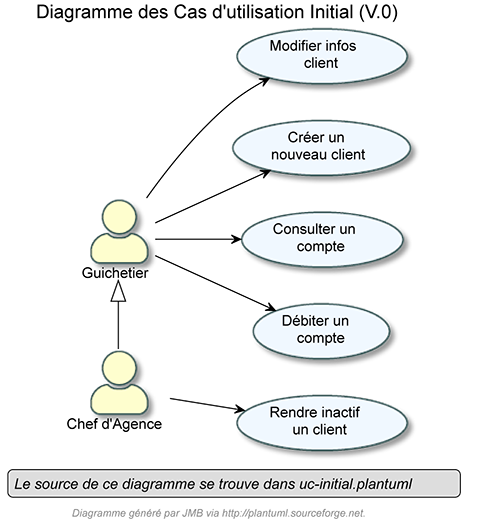
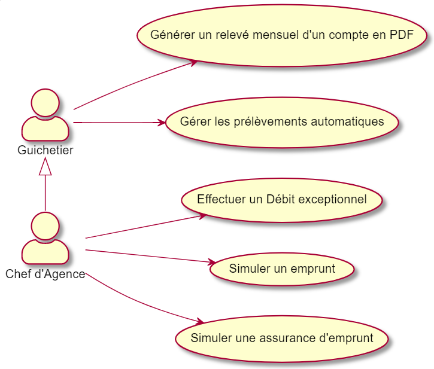

= CDCU V3 Daily Bank App
XU Anton - GAYRARD Loan - ROBERT Matthieu
v3.0, 10/05/2022 - Equipe 1b1
:toc:
:toc-title: Sommaire
:nofooter:

<<<

== 1. Présentation du sujet

=== a) Contexte général

Dans le contexte actuel des banques françaises avec l’arrivée des néobanques, il est important pour les banques historiques de se digitaliser et d’utiliser de plus en plus d’outils informatiques. Ceux-ci permettront d’effectuer en temps réel et de rendre accessibles les différentes opérations bancaires, autant pour les employés d’agence bancaire que pour les clients. En effet, la robotisation et le développement digital des services bancaires permettront de satisfaire les exigences d’instantanéité et d’efficacité des clients. C’est ainsi que notre projet Daily Bank App s’inscrit dans la modernisation de la banque Daily Bank. Daily Bank App est une application JAVA-Oracle de gestion des comptes clients pour une banque nommée Daily Bank. Cette célèbre banque possède déjà une application, mais elle est incomplète et il lui manque de nombreuses fonctionnalités. Elle souhaite proposer à ses clients une application rapide et simple d’utilisation, qui leur permettra d’interagir avec leur compte bancaire de manière instantanée. Cette application devra donc simplifier les actions bancaires des utilisateurs, mais elle devra aussi aider les employés de l’entreprise en leur permettant de gérer les comptes des clients en ligne et de manière immédiate. Pour ce projet, nous sommes une équipe de 3 développeurs, et grâce à nos compétences en informatique nous allons nous organiser pour proposer et implémenter de meilleures versions de l’application Daily Bank App qui, au fur et à mesure des versions, vont simplifier les relations entre les clients et les employés.

=== b) Problématique

Étant donné le contexte et les contraintes imposées, comment allons-nous procéder afin de réaliser ce projet dans les temps et dans les conditions les plus optimales ?

<<<

== 2. Analyse de l'existant

Dans la V0, les opérations possibles sont encore très limitées, il n'est pas possible de créer de nouveau compte ni de créditer un compte.

Cependant, il existe quand même différents profils d'utilisateurs qui sont le Guichetier et le Chef d'agence. Le guichetier peut créer et gérer les clients. Le Chef d'agence est un guichetier qui, en plus, peut rendre inactif un client.

Les seuls 5 cas d'utilisation ne permettent pas encore à l'application existante d'être utilisée telle quelle.
 

<<<

== 3. Analyse des besoins

=== a) Analyse des besoins de la V1

Diagramme de cas d'utilisation de la V1

image::../assets/ucv1.png[uc V1, 500]

Le guichetier doit avoir la possibilité de créditer un compte d'un client avec un montant donné, afin d'ajouter de l'argent sur son compte.

Le guichetier doit avoir la possibilité de débiter un compte d'un client avec un montant donné, afin de retirer de l'argent sur son compte.

Le guichetier doit avoir la possibilité de créer un compte pour un client, et de l'ajouter à la base de donnée des comptes.

Le guichetier doit avoir la possibilité d'effectuer des virements de compte à compte, avec un montant donné.

Le guichetier doit avoir la possibilité de clôturer un compte d'un client, afin de le rendre inactif.

Le chef d'agence doit avoir la possibilité d'effectuer les mêmes opérations que le guichetier, mais avec plus de contrôle.

Le chef d'agence doit avoir la possibilité de gérer les employés de son agence.

<<<

=== b) Analyse des besoins de la V2

Diagramme de cas d'utilisation de la V2

Le guichetier doit avoir la possibilité de générer un relevé mensuel d'un compte en PDF sur lequel figurera les différentes opérations effectué sur le compte pendant un mois donné.

Le guichetier doit avoir la possibilité de gérer les prélèvements automatiques.

Le chef d'agence doit avoir la possibilié d'effectuer un débit exceptionnel.

Le chef d'agence doit avoir la possibilité de simuler un emprunt à l'aide des informations d'un client.

Le chef d'agence doit avoir la possibilité de simuler une assurance d'emprunt à l'aide des différentes informations d'un client.

<<<

=== c) Analyse des besoins de la V3

Diagramme de cas d'utilisation de la V3

image::../assets/ucv3.png[uc V3, 500]

Dans cette troisième version de notre application, nous allons implémenter les fonctions suivantes en plus de celles déjà présentes :

- La spécification finalisée de la version 2
- La création de super options pour le chef d'agence

Dans cette version, il y a aura l'ajout d'un batch ou traitement par lots qui réalisera certaines opérations automatiquement, sans l'intervention d'une personne :

- La génération des relevés mensuels de compte en format PDF
- L'exécution des prélèvements automatiques

<<<

== 4. Analyse des contraintes

=== a) Contraintes techniques

Les nouvelles versions devront être programmées en Java, en couple avec le système de gestion de base de données Oracle. Ce dernier devra stocker toutes les procédures effectuées sur les comptes.

=== b) Contraintes organisationnelles

La V3 devra être produite durant les semaines 22 à 23, et devra être livrée le 3 juin 2022, avec la participation de tous les membres du groupe.

L'organisation du développement de l'application se fera par Git, chaque fonctionnalité développée aura sa propre branche.

Finalement, nous effectuerons un merge de toutes les branches par l'intermédiaire de pull requests.

Lors de ce projet, Project Libre sera utilisé pour la réalisation du Gantt, Asciidoc sera utilisé pour la rédaction du cahier des charges, de la documentation utilisateur et de la documentation technique.

Le suivi de l'avancée du projet se fera à l'aide des issues sur GitHub.

=== c) Contraintes juridiques

Tout d'abord, notre application devra respecter les contraintes juridiques sur la protection des données des utilisateurs (RGPD).

Les données sensibles des clients de la banque, comme les numéros de carte bancaire ou bien les données personnelles, devront être stockés de manière sécurisée afin d'éviter toute fuite de données.

De plus, notre application devra être éthique et modifier les données des clients seulement si ces derniers le souhaitent (numéro de carte bleue, propriétaire du compte...) et modifier le solde des comptes bancaires seulement lorsqu'un achat est effectué.

Notre application devra donc rester sécurisée et fiable afin de respecter les lois en vigueur, mais aussi de rassurer les futurs clients de la banque et utilisateurs de l'application.